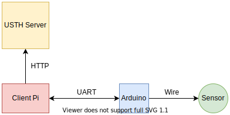

# Deploy system
USTH Smart Garden

Simplify the system with only 1 pi

## UART Connection
In this system, there are 3 ways for UART implementation:

1. Wire connection
2. Zigbee connection
3. Lora connection

### Wire & Zigbee
- Arduino code: same in both case
- Pi code: same in both case

### Lora
- Arduino code: apply [lib link](https://wiki.seeedstudio.com/Grove_LoRa_Radio)
- Pi code: apply [lib link](https://github.com/erazor83/pyRFM)

## Directory Explanation
| dir | description |
|-----|-------------|
| client| Pi code |
| server| USTHServer code |
| sensor | Arudino code |
