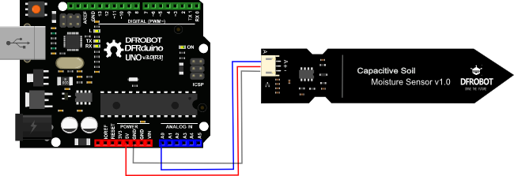

---
title: "Smart Clean Garden"
author: \textbf{DO Duy Huy Hoang} \newline
        \textbf{Supervisor} TRAN Giang Son \newline
        \newline
        \newline
        \textit{University of Science and Technology Hanoi} \newline 
        \textit{ICT Department}
date: "2019-06-18"
titlepage: true
header-includes: |
    \usepackage{multicol}
    \usepackage{graphicx}
footer-left: Do Hoang
mainfont: Times New Roman
caption-justification: centering
...
\pagenumbering{Roman} 
\newpage{}
\listoftables
\newpage{}
\listoffigures
\newpage{}
\tableofcontents
\newpage{}
\pagenumbering{arabic} 

# I. KHẢO SÁT - PHÂN TÍCH – THIẾT KẾ HỆ THỐNG THÔNG TIN QUẢN LÝ THỊ TRƯỜNG KHCN

## 1.1 Bài toán thị trường KHCN của dự án Vườn thông minh USTH

Nông nghiệp công nghệ cao là nền nông nghiệp được áp dụng các công nghệ tiên tiến nhằm mục đích cải thiện chất lượng, năng suất nông sản. 
Điều này có thể đạt được bằng cách giám sát các thông số liên quan đến sinh trưởng, phát triển của cây trồng như: ánh sáng, nhiệt độ, độ ẩm...
Từ các thông số thu thập, có thể điều chỉnh lượng nước tưới, độ ẩm không khí hay cường độ ánh sáng phù hợptheo nhu cầu phát triển của cây trồng.
Hiện nay, các hướng nghiên cứu về ứng dụng côngnghệ cao trong giám sát từ xa các thông số môi trườngtrong nông nghiệp thường sử dụng các công nghệ truyền thông truyền thống như: Zigbee, Wifi, GSM/GPRS,Bluetooth...
Trong những công nghệ truyền thông kể trên, công nghệ Wifi, Zigbee, Bluetooth có phạm vi hoạt động không cao từ 10 đến 100m. 
Với phạm vi hoạt động như vậy, các chuẩn truyền thông trên chỉ phù hợp cho việc giám sát trong một khu vực nhỏ. 
Khi khu vực giám sát lớn hoặc có nhiều khu vực, thì việc xây dựng mạng cảm biến trở lên phức tạp và tốn kém chi phí hơn. Bên cạnh đó, việc tiêu thụ nhiều năng lượng cũng dẫn đến thời lượng sử dụng pin của nút cảm biến bị giảm xuống. 
Vì vậy công nghệ LoRa đã ra đời để phần nào giải quyết vấn đề kể trên.
Trong nghiên cứu này, nhóm nghiên cứu đã chế tạo thành công hệ thống mạng cảm biến và điều khiển không
dây sử dụng chuẩn truyền thông LoRa.

## 1.2 Phân tích yêu cầu
### A. Các yêu cầu đối với hệ thống

### B. Mô hình các use cases đặc tả cảc yêu cầu chức năng của hệ thống

### C. Biểu đồ lớp thể hiện cấu trúc bên trong của hệ thống

## 1.3 THIẾT KẾ HTTT QUẢN LÝ THỊ TRƯỜNG KHCN

### A. Kiến trúc hệ thống

### B. Phân tích các gói thành phần trong kiến trúc của hệ thống

Hiện tại hệ thống của chúng tôi đang dựa trên hai cảm biến sau:

* Cảm biến độ ẩm đất điện dung
* Cảm biến độ ẩm đất điện trở 

#### Cảm biến độ ẩm đất điện dung

{ width=4in }

Cảm biến này đo độ ẩm của đất bằng cảm biến điện dung, thay vì cảm biến điện trở như các loại cảm biến độ ẩm khác. 
Nó được làm bằng vật liệu chống ăn mòn mang lại tuổi thọ cao. 
Đồng thời dữ liệu được trả về với thời gian thực.

Sản phẩm bao gồm một bộ điều chỉnh điện áp trên bo mạch cho nó một phạm vi điện áp hoạt động từ 3,3 ~ 5,5V. 
Nó tương thích với MCU điện áp thấp (cả mức 3,3V và 5V). 
Để làm cho nó tương thích với Raspberry Pi, cần có bộ chuyển đổi ADC.

Ví dụ, chúng ta có thể sử dụng Arduino để đọc giá trị trực tiếp từ cảm biến.

**Tính năng, hỗ trợ**

* Hỗ trợ kết nối tốt với arduino
* Đầu ra analog

**Các ứng dụng**

* Làm vườn & canh tác
* Phát hiện độ ẩm
* Nông nghiệp thông minh

**Thông số kỹ thuật**

* Điện áp hoạt động: 3,3 ~ 5,5 VDC
* Điện áp đầu ra: 0 ~ 3.0VDC
* Cường độ dòng điện: 5mA
* Giao tiếp: PH2.0-3P
* Kích thước: 3,86 x 0,90 inch (L x W)
* Trọng lượng: 15g

**Sơ đồ mạch**

{ width=5in }

**Kết nối**

{ width=7in }

| Aduino Uno    | Cảm biến độ ẩm đất điện dung   |
|---------------|---------------------------------|
| GND           | GND ( Black wire )              |
| 5V            | Red Wire                        |
| Analog output | Blue Wire                       |
Table: Mạch kết nối giữa cảm biến độ ẩm đất điện dung và Arduino Uno

**Phạm vi hiệu chuẩn**
\
Các thành phần trên bảng này KHÔNG thấm nước, không được để mạch điện tiếp xúc với độ ẩm quá vạch màu đỏ. 
(Nếu bạn muốn bảo vệ các thành phần khỏi các yếu tố, hãy thử sử dụng ống co nhiệt bao quanh chiều dài của cảm biến) 
Có một tỷ lệ nghịch giữa đầu ra cảm biến giá trị và độ ẩm của đất.

{ width=2.4in }

* Giá trị đầu ra cuối cùng bị ảnh hưởng bởi độ sâu chèn đầu dò và độ chặt của đất xung quanh nó.
* Phạm vi sẽ được chia thành ba phần: khô, ướt, nước. Giá trị liên quan của chúng là:
  * Khô: (520 430]
  * Ướt: (430 350]
  * Nước: (350 260]

**Chương trình mẫu**
\
Chương trình mẫu của chúng tôi có thể được tìm thấy [**tại đây**](https://github.com/huyhoang8398/SmartGarden/blob/master/Capacitive_Soil_Moisture_Sensor_SKU_SEN0193/ExampleCode/ExampleCode.c)

#### Cảm biến độ ẩm đất điện trở

{ width=2.7in }

Cảm biến này đối với Arduino có thể đọc lượng ẩm có trong đất xung quanh nó. Đó là một cảm biến công nghệ thấp, nhưng lý tưởng để theo dõi một khu vườn đô thị, hoặc mực nước của khu vườn tại nhà của bạn. 
Đây là một công cụ cần thiết cho một khu vườn thông minh!
Cảm biến độ ẩm đất mới sử dụng Vàng ngâm để bảo vệ niken khỏi quá trình oxy hóa. 
Vàng ngâm niken điện phân (ENIG) có một số lợi thế so với các bề mặt thông thường (và rẻ hơn) như HASL (hàn), bao gồm cả bề mặt phẳng tuyệt vời (đặc biệt hữu ích cho PCB với các gói BGA lớn), chống oxy hóa tốt và khả năng tiếp xúc không được xử lý các bề mặt như màng chuyển mạch và các điểm tiếp xúc.

Cảm biến arduino độ ẩm đất này sử dụng hai đầu dò để truyền dòng điện qua đất, và sau đó nó đọc điện trở đó để có được độ ẩm. 
Nhiều nước làm cho đất dẫn điện dễ dàng hơn (ít điện trở hơn), trong khi đất khô dẫn điện kém (điện trở nhiều hơn). 
Cảm biến này sẽ hữu ích để nhắc nhở bạn tưới nước cho cây trồng trong nhà hoặc theo dõi độ ẩm của đất trong khu vườn của bạn.

**Ghi chú**: Nếu bạn có ý định sử dụng cảm biến này trong điều kiện đất quá ẩm, nó rất có thể gây ra việc oxi hóa bề mặt của cảm biến chỉ trong vài ngày,
Vì vậy, chúng tôi khuyến nghị việc sử dụng cảm biến đổ ẩm đất điện trở tích hợp kháng ăn mòn.

**Thông số kĩ thuật**

* Nguồn điện: 3,3V ~ 5V
* Tín hiệu điện áp đầu ra: 0 ~ 4.2V
* Cường độ dòng điện: 35mA
* Định nghĩa pin:
  * Màu xanh dương: đầu ra tương tự
  * Đen: GND
  * Đỏ: Nguồn vào
* Kích thước: 60x20x5mm
* Phạm vi giá trị:
  * 0 ~ 300: đất khô
  * 300 ~ 700: đất ẩm
  * 700 ~ 950: trong nước

**Sơ đồ mạch**

{ width=2.3in }

| Aduino Uno    | Cảm biến độ ẩm đất điện trở     |
|---------------|---------------------------------|
| GND           | GND ( Dây đen )                 |
| 5V            | Dây Đỏ                          |
| Tín hiệu ra   | Dây xanh                        |
Table: Mạch kết nối giữa cảm biến độ ẩm đất điện trở và Arduino Uno

**Phạm vi hiệu chuẩn**

* Phạm vi sẽ được chia thành ba phần: đất khô, đất ướt, trong nước. Giá trị liên quan của chúng là:
  * 0 ~ 300 - đất khô
  * 300 ~ 700 - đất ẩm
  * 700 ~ 950 - trong nước

**Chương trình mẫu**
\
Chương trình mẫu có thể tìm thấy tại [**đây**](https://github.com/huyhoang8398/SmartGarden/blob/master/Analog_Soil_Moisture_Sensor_SKU_SEN0114/SampleCode/SampleCode.ino)

### C. Giao thức truyền thông

#### Mạch LoRa

Công nghệ LoRa , được phát triển bởi Semtech , là một giao thức không dây mới được thiết kế để truyền thông tầm xa, năng lượng thấp. 
Giao thức cung cấp loại khả năng liên lạc mà các thiết bị thông minh cần có, và Liên minh LoRa đang hoạt động để đảm bảo khả năng tương tác giữa nhiều mạng trên toàn quốc.

Một phần của phổ LoRa sử dụng thể hiện ít nhiễu điện từ, do đó tín hiệu có thể kéo dài một khoảng cách xa, thậm chí đi qua các tòa nhà, với rất ít năng lượng. 
Điều này phù hợp với các thiết bị IoT với dung lượng pin hạn chế. 
Điều đó cũng có nghĩa là các tinh thể chi phí thấp hơn có thể được sử dụng, do đó, việc xây dựng LoRa thành các thiết bị rẻ hơn.

Mỗi gateway LoRa có thể xử lý hàng triệu node. 
Điều đó, cộng với thực tế là các tín hiệu có thể kéo dài khoảng cách đáng kể, có nghĩa là cần ít cơ sở hạ tầng mạng hơn, do đó làm cho việc xây dựng mạng LoRa rẻ hơn. 
Các mạng LoRa có thể được đặt cùng với các thiết bị liên lạc khác, như các tháp điện thoại di động, làm giảm đáng kể các hạn chế xây dựng.

Các tính năng khác của LoRa cũng khiến nó trở nên lý tưởng cho IoT. 
LoRa sử dụng thuật toán tốc độ dữ liệu thích ứng để giúp tối đa hóa tuổi thọ pin và dung lượng mạng của thiết bị. 
Các giao thức của nó bao gồm nhiều lớp mã hóa, ở cấp độ mạng, ứng dụng và thiết bị, cho phép liên lạc an toàn. 
Tính hai chiều của giao thức hỗ trợ các thông điệp quảng bá, cho phép chức năng cập nhật phần mềm.

Sự phát triển của Internet of Things bị giới hạn bởi dung lượng của mạng, bởi khả năng hoạt động của thiết bị mà không cần thay pin và bởi khả năng mã hóa truyền dẫn bí mật.
Các tính năng được tích hợp trong LoRa cung cấp tất cả các khả năng này và sẽ cho phép sự phát triển rộng rãi của IoT. 
Với công nghệ Lora, chúng ta có thể truyền dữ liệu với khoảng cách lên hàng km mà không cần các mạch khuếch đại công suất; từ đó giúp tiết kiệm năng lượng tiêu thụ khi truyền/nhận dữ liệu. 
Do đó, LoRa có thể được áp dụng rộng rãi trong các ứng dụng thu thập dữ liệu như sensor network trong đó các sensor node có thể gửi giá trị đo đạc về trung tâm cách xa hàng km và có thể hoạt động với pin trong thời gian dài trước khi cần thay pin.

**So sánh Lora cùng các công nghệ khác**
Hiện nay, mọi người rất hào hứng với tất cả các khả năng do các cảm biến và thiết bị mới mang lại cho khối lượng dữ liệu hữu ích. 
Nhưng chuyện gì sẽ xảy ra nếu những cảm biến này dừng đột ngột việc phát dữ liệu do hết pin ? 
Pin sẽ cần phải được thay đổi cứ sau vài ngày hoặc vài tuần? Và 1 mạng sẽ xử lý lưu lượng dữ liệu lớn như thế nào?
Rõ ràng, một trong những thách thức chính trong việc xây dựng Internet vạn vật là đảm bảo rằng tất cả những thứ đó trên thực tế có thể giao tiếp qua Internet. 
Số lượng thiết bị IoT là số lượng lớn 25 tỷ thiết bị vào năm 2020, theo một ước tính, và bất kỳ mạng nào hỗ trợ giao tiếp đó phải mở rộng để xử lý lưu lượng. 
Vì vậy, có những vấn đề đối với mạng và cũng có vấn đề với chính các thiết bị IoT: chúng chạy bằng nguồn pin, có sóng yếu và có bộ nhớ và khả năng xử lý hạn chế.
Các thiết bị IoT ngày nay chọn từ một số công nghệ để hỗ trợ liên lạc của họ, nhưng không có thiết bị nào là lý tưởng. Wi-Fi có ở khắp mọi nơi, nhưng nó sử dụng nhiều năng lượng và truyền nhiều dữ liệu. 
Đây không phải là một kết hợp hoàn hảo cho các thiết bị IoT không có năng lượng dự phòng và thường gửi dữ liệu hạn chế với số lượng nhỏ. 
Và cũng có những hạn chế về số lượng thiết bị mà một bộ định tuyến Wi-Fi có thể xử lý và chúng có thể hết dung lượng khi số lượng thiết bị IoT trong nhà tăng lên.

**Băng tần làm việc của LoRa từ 430MHz đến 915MHz cho từng khu vực khác nhau trên thế giới:**

* 430MHz cho châu Á
* 780MHz cho Trung Quốc
* 433MHz hoặc 866MHz cho châu Âu
* 915MHz cho USA

**Giao tiếp Raspberry Pi với LoRa**
\
Mô-đun Lora giao tiếp bằng SPI trên Logic 3.3V. 
Raspberry pi cũng hoạt động ở mức logic 3,3V và cũng có cổng SPI tích hợp và bộ điều chỉnh 3,3V. 
Vì vậy, chúng ta có thể kết nối trực tiếp mô-đun LoRa với Raspberry Pi. Bảng kết nối được hiển thị dưới đây

| Raspberry Pi | Lora Module  |
|--------------|--------------|
| 3.3V         | 3.3V         |
| Ground       | Ground       |
| GPIO 10      | MOSI         |
| GPIO 9       | MISO         |
| GPIO 11      | SCK          |
| GPIO 8       | Nss / Enable |
| GPIO 4       | DIO 0        |
| GPIO 17      | DIO 1        |
| GPIO 18      | DIO 2        |
| GPIO 27      | DIO 3        |
| GPIO 22      | RST          |
Table: Mạch kết nối giữa cảm biến LoRa và Rpi

Bạn cũng có thể sử dụng sơ đồ mạch dưới đây để tham khảo.

{ width=3.2in }

**Kết nối Arduino với mạch LoRa**

Bên truyền - Kết nối LoRa với Arduino UNO
Đối với phía truyền phát, chúng tôi sẽ sử dụng Arduino UNO với mô-đun LoRa của chúng tôi. 
Sơ đồ mạch để kết nối Arduino UNO với LoRa được hiển thị bên dưới. 
Mô-đun hoạt động trong 3,3V và do đó chân 3,3V trên LoRa được kết nối với chân 3,3v trên bo mạch Arduino UNO.

| LoRa SX1278 Module | Arduino UNO Board |
|--------------------|-------------------|
| 3.3V               | 3.3V              |
| Gnd                | Gnd               |
| En/Nss             | D10               |
| G0/DIO0            | D2                |
| SCK                | D13               |
| MISO               | D12               |
| MOSI               | D11               |
| RST                | D9                |
Table: Mạch kết nối giữa cảm biến LoRa và Arduino Uno

Chúng tôi đang sử dụng mô-đun Lora được cung cấp từ công ty Seeed Studio. Mô-đun chức năng chính trong Grove - LoRa Radio 433 MHz là RFM98, đây là bộ thu phát có modem tầm xa LoRa cung cấp liên lạc trải phổ cực xa và khả năng chống nhiễu cao trong khi tiêu thụ điện năng thấp.
Mạch sử dụng chip ATmega168, một con chip được sử dụng rộng rãi với hiệu suất rất cao và tiêu thụ điện năng thấp, đặc biệt phù hợp với dự án này.
Đây là phiên bản 868 MHz, có thể được sử dụng cho giao tiếp 868 MHz.

**Tính năng**

* Sử dụng mô-đun RFM95 dựa trên SX1276 LoRa®
* Điện áp tiêu chuẩn: 5V / 3.3V
* ~ 28mA (Trung bình) @ + 20dBm truyền liên tục
* ~8.4mA(Avg)@standby chế độ
* ~ 20mA (Trung bình) chế độ @receive, BW-500kHz
* Nhiệt độ tiêu chuẩn: -20 - 70 Celcius
* Giao diện: Grove - UART (RX, TX, VCC, GND)
* Tần số làm việc: 868 MHz / 433 MHz
* +20dBm 100 mW Khả năng đầu ra công suất
* Kích thước: 20 * 40mm
* Tốc độ: 0,3kps ~ 50kps
* Thư viện Arduino sẵn sàng hoạt động

Từ trang web chính thức, Nền tảng được hỗ trợ chỉ là Arduino. 
Để làm việc với Raspberry Pi, chúng tôi phải sử dụng thư viện của bên thứ ba từ [**tại đây**](https://github.com/erazor83/pyRFM)

Sơ đồ mạch kết nối giữa Mạch Grove LoRa và Raspberry Pi

#### Zigbee

Mạch thu phát RF Zigbee UART CC2530 V1 sử dụng IC CC2530 từ TI, mạch được lập trình sẵn firmware để có thể dễ dàng sử dụng như một module truyền nhận dữ liệu không dây chuẩn Zigbee với giao tiếp UART rất dễ kết nối với vi điều khiển hoặc máy tính (thông qua cáp chuyển USB-UART) với chỉ một vài bước config bằng nút nhấn.

Mạch thu phát RF Zigbee UART CC2530 V1 có khoảng cách truyền nhận xa, chuẩn truyền sóng Zigbee 2.4Ghz chuẩn công nghiệp rất ổn định và có khả năng cấu hình tạo thành mạng truyền nhận không dây với nhiều nút, điểm mạng khác khau qua giao thức Zigbee.

**Tính năng**

* Hãng sản xuất danh tiếng Zigbee
* Tên phiên bản: Zigbee UART CC2530 +PA V2.
* IC chính: Zigbee CC2530 từ TI, phiên bản nâng cấp có thêm ic Khuếch đại PA CC2591.
* Hoạt động ở cả 2 chế độ phát và thu.
* Tốc độ truyền tối đa : 3300Bps (Byte per second ) (bằng 26400 bit/s ). Đối với các ứng dụng Stream như truyền dẫn video hoặc voice (chất lượng thấp) thì bạn có thể sử dụng với tốc độ lên tới 7000 Bps (có thể sẽ mất mát dữ liệu). 
* Độ nhạy truyền: 20dbm
* Khoảng cách  truyền xa không dưới 1500m (không vật cản), độ cao truyền sóng không dưới 3.5 km. (không vật cản)
* Điện áp : 2.8v => 3.5v
* Dòng tiêu thụ: <50mA.
* Bộ nhớ flash 256kb
* Độ nhạy thu : -97dBm với ic PA CC2591 ( -110dBm cho module thường).
* Tần số sóng mang 2.4GHZ, khả năng bức xạ và xuyên thấu vật cản rất cao.
* Giao thức Serial (UART) TTL 3.3V, tốc độ giao thức (baudrate) tùy chỉnh từ 2440 tối đa 115200. (2400/4800/9600/14400/19200/38400/57600/115200)
* Kích thước 1.6 cm x 3.4cm

**USB UART CP2102**
Bộ chuyển đổi USB này đang sử dụng CP2102 và được sử dụng để chuyển USB sang UART TTL và ngược lại.

Bộ chuyển đổi USB UART CP2102 có thể được sử dụng trên tất cả các nền tảng Windows, Mac, Linux, Android.
Hỗ trợ tốc độ truyền như 300, 600, 1200, 1800, 2400, 4000, 4800, 7200, 9600, 14400, 16000, 19200, 28800, 38400, 51200, 56000, 57600, 64000, 76800, 115200, 128.000, 153.600, 230.400 , 250.000, 256.000, 460.800, 500.000, 576.000, 921.600 và các loại tốc độ khác.

Để sử dụng bộ chuyển đổi này, chúng tôi cần cài đặt trình điều khiển từ [**Silicon Labs**](https://www.silabs.com/products/development-tools/software/usb-to-uart-bridge-vcp-drivers )

*Tính năg*

* Nguồn điện: 3 - 5,5VDC
* Điện áp: <30mA.
* Truyền sóng Zigbee 2.4Ghz tiêu chuẩn.
* Tốc độ truyền tối đa: 3300bps.
* Dung lượng truyền: 4,5dbm.
* Khoảng cách: 250m.
* Kết nối giao thức UART TTL (3.3VDC hoặc 5VDC), Baudrate tối đa 115200.
* Kích thước: 15,5x31,5mm.

*Sơ đồ kết nối*

| USB UART CP2102 | Zigbee cc2530 |
|-----------------|---------------|
| 5V              | 5V            |
| GND             | GND           |
| Rx              | Tx            |
| Tx              | Rx            |
Table: Mạch kết nối giữa cảm biến Zigbee và USB UART

Chúng tôi sử dụng bộ chuyển đổi UART-USB để kết nối mô-đun zigbee với Pi của chúng tôi vì các chân UART trên nó được sử dụng cho mô-đun Lora.

### D. Thiết kế cơ sở dữ liệu

**Lưu ý:** Kiến trúc cơ sở dữ liệu này được xây dựng dựa trên kiến ​​thức hiện tại của chúng tôi về hệ thống. Nó có thể thay đổi trong tương lai do sử dụng thực tế

Trong Cơ sở dữ liệu, Nó chứa 4 bảng là bảng `Sensors_Type`, `Sensor_List`, `Personal_Sensor` và bảng Data.

Chúng tôi đã tạo bảng `Sensor_Type` để phân loại các cảm biến khác nhau như (Độ ẩm, Nhiệt, cảm biến Gia tốc, ..) bằng ID riêng của chúng.

Bảng `Sensor_List` chứa tất cả ID cảm biến, ví dụ: SKU_SEN0114 - viết tắt của Cảm biến độ ẩm đất tương tự.

Bảng `Individual_Sensor` chứa tất cả các cảm biến và mỗi cảm biến có giá trị chỉ mục riêng và vị trí của chúng.

Bảng Data chứa giá trị và thời gian chúng ta đọc giá trị đó từ cảm biến.

# II. XÂY DỰNG - CÀI ĐẶT HTTT QUẢN LÝ THỊ TRƯỜNG KHCN
## 2.1 MÔI TRƯỜNG VÀ CÁC CÔNG CỤ PHÁT TRIỂN

### A. Python 

#### Tổng quan về ngôn ngữ lập trình Python

Python là ngôn ngữ lập trình hướng đối tượng, cấp cao, mạnh mẽ.
Python hoàn toàn tạo kiểu động và sử dụng cơ chế cấp phát bộ nhớ tự động. 
Python có cấu trúc dữ liệu cấp cao mạnh mẽ và cách tiếp cận đơn giản nhưng hiệu quả đối với lập trình hướng đối tượng. 
Cú pháp lệnh của Python là điểm cộng vô cùng lớn vì sự rõ ràng, dễ hiểu và cách gõ linh động làm cho nó nhanh chóng trở thành một ngôn ngữ lý tưởng để viết script và phát triển ứng dụng trong nhiều lĩnh vực, ở hầu hết các nền tảng. 

#### Ưu điểm của Python trong IOT 

Python chủ yếu được sử dụng để sử dụng trong giới data scientist nhưng đã trở nên phổ biến trong hệ thống IoT. Python phù hợp với các chuyên gia lập trình yêu cầu sự đơn giản. Ngoài ra, Python còn có thể được mở rộng để sử dụng trong ngành công nghiệp hoặc phân tích dữ liệu trong lĩnh vực tài chính. Đối với bất kỳ ứng dụng nào đòi hỏi khả năng truy xuất dữ liệu lớn thì Python là một ứng cử viên rất tiềm năng và cũng đủ mạnh để ứng dụng trong các nền tảng nhúng.

Ngôn ngữ này có khối lượng thư viện lớn, có thể hoàn thành nhiều công việc hơn với ít code hơn. Cú pháp sạch Python thích hợp cho việc sắp xếp cơ sở dữ liệu. Trong trường hợp ứng dụng của bạn cần dữ liệu được sắp xếp theo định dạng cơ sở dữ liệu hoặc dùng bảng thì Python là lựa chọn đúng đắn nhất.

### B. Nền tảng Arduino 
#### Tổng quan về nền tảng Arduino
Arduino là một nền tảng mã nguồn mở được sử dụng để xây dựng các ứng dụng điện tử tương tác với nhau hoặc với môi trường được thuận lợi hơn.
Arduino tương tác với thế giới thông qua các cảm biến điện tử, đèn, và động cơ.
Arduino gồm:

* Phần cứng gồm một board mạch mã nguồn mở (thường gọi là vi điều khiển): có thể lập trình được.
* Các phần mềm hỗ trợ phát triển tích hợp IDE (Integrated Development Environment) dùng để soạn thảo, biên dịch code và nạp chương cho board.

#### Ưu điểm của Arduino trong IoT
- Arduino có khả năng đọc các thiết bị cảm biến, điều khiển động cơ,… nên nó thường được dùng để làm bộ xử lý trung tâm của rất nhiều loại dự án IoT.
- Mã nguồn mở: Phần cứng và phần mềm của Arduino đều là nguồn mở - các sơ đồ đều được công khai trực tuyến nên bạn hoàn toàn có thể mua linh kiện và tự tạo dự án của riêng mình.
- Tính linh hoạt và chi phí: 
  - Mức giá cho một thiết bị này vào khoảng $50, thấp hơn nhiều so với các nền tảng vi điều khiển khác, mức giá này rất phù hợp với các bạn trẻ và các tổ chức giáo dục. 
  - Ngôn ngữ lập trình mà bạn sử dụng với nó là khá đơn giản và quen thuộc với bất cứ ai đã từng có kinh nghiệm với C hoặc các ngôn ngữ tương tự. (Nó thực sự dựa trên Processing).
  - Nó cũng là một công cụ học tập tuyệt vời, bạn có thể thử nghiệm với các thiết bị điện tử và tìm hiểu những kiến thức nền tảng. 
- Khả năng kết nối: Arduino có thể hoạt động độc lập hoặc kết nối với một máy tính (do đó cho phép máy tính của bạn truy cập dữ liệu cảm biến từ thế giới bên ngoài và cung cấp thông tin phản hồi) hoặc kết nối với các Arduino hay thiết bị điện tử khác và các chip điều khiển. 

### C. Hệ quản trị cơ sở dữ liệu MySQL 

#### Tổng quan về MySQL

Một cơ sở dữ liệu quan hệ xác định các mối quan hệ dưới dạng các bảng.
Lập trình SQL có thể được sử dụng hiệu quả để chèn, tìm kiếm, cập nhật, xóa các bản ghi cơ sở dữ liệu.
Điều đó không có nghĩa là SQL không thể làm được gì ngoài việc đó. Nó có thể làm rất nhiều thứ bao gồm, nhưng không giới hạn, tối ưu hóa và duy trì cơ sở dữ liệu.

Đây là một lựa chọn lý tưởng cho môi trường truy vấn phức tạp, nó phải được cấu hình cho sự nhất quán chặt chẽ.

Hỗ trợ đa nền tảng, Bảo mật và miễn phí

#### Ưu điểm của SQL

Với dự án Smart Clean Garden, SQL databases không thích hợp cho việc lưu trữ dữ liệu phân cấp, database cần được được cấu hình nhất quán chặt chẽ. 
Hơn nữa, Dự án đã có yêu cầu dữ liệu rõ ràng xác định quan hệ logic có thể được xác định trước.
Vậy nên chúng tôi sử dụng SQL thay vì NoSQL database.

* SQL là ngôn ngữ đơn giản nhất được sử dụng để giao tiếp với RDBMS
* Phân tích các phiên liên quan đến hành vi và tùy chỉnh
* Tạo trang tổng quan tùy chỉnh
* Nó cho phép bạn lưu trữ và lấy dữ liệu từ cơ sở dữ liệu một cách nhanh chóng
* Được ưu tiên khi bạn muốn sử dụng các phép nối và thực hiện các truy vấn phức tạp

## 2.2. XÂY DỰNG HỆ THỐNG

Trong vườn, chúng tôi đang sử dụng tổng số mười hai cảm biến để đo dữ liệu độ ẩm của đất trong mỗi bộ lọc.
Chúng tôi có ba bộ lọc và mỗi bộ lọc có thêm hai bộ lọc phụ với hai cảm biến.
Tất cả các cảm biến được kết nối với nhau bằng Arduino Mega.

Để truyền dữ liệu, chúng tôi sử dụng mô-đun zigbee và LoRa. 
Do đó, Raspberry Pi không thể đọc trực tiếp giá trị tương tự từ cảm biến nên chúng tôi sử dụng Arduino Mega để làm điều đó.
Và chúng tôi đặt một Raspberry Pi (được gắn với mô-đun Zigbee và Lora), nó sẽ gửi yêu cầu tới Arduino Mega (cũng được gắn với mô-đun Zigbee) để nhận dữ liệu từ cảm biến.
Chúng tôi cũng thiết lập một cronjob để lên lịch yêu cầu thời gian cho dữ liệu tùy thuộc vào thời gian các bộ lọc sẽ được cung cấp với chất thải.

Sau khi nhận được dữ liệu từ Arduino, Raspberry pi trong vườn sẽ gửi những dữ liệu này đến một Raspberry Pi khác nằm trong Tòa nhà USTH của LoRa. 
Và dữ liệu sẽ được gửi đến máy chủ USTH bằng giao thức HTTP.

# III. MỘT SỐ KẾT QUẢ CHÍNH

