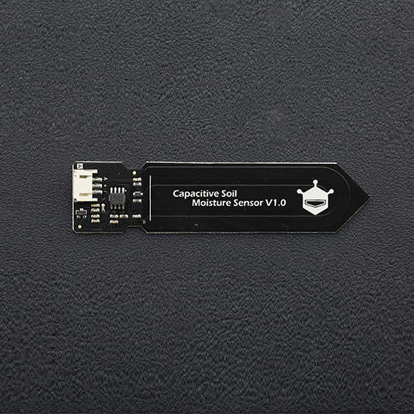

# Capacitive Soil Moisture Sensor - SKU_SEN0193


## Specification

* Operating Voltage: 3.3 ~ 5.5 VDC
* Output Voltage: 0 ~ 3.0VDC
* Operating Current: 5mA
* Interface: PH2.0-3P
* Dimensions: 3.86 x 0.905 inches (L x W)
* Weight: 15g

## Reqirement
* Requirements
  * Hardware
    * ARduino UNO x1
    * Capacitive Soil Moisture Sensor x1
    *Jumper Cable x3
  * Software
    * Arduino IDE 

## Connection
```
Aduino Uno ||  Capacitive Soil Moisture Sensor
GND	   ||  GND 
5V	   ||  5V
A0	   ||  Analog pin 
```


## Calibration
### Calibration Range


```
The components on this board are NOT waterproof, do not expose to moisture further than the red
line. (If you want to protect components from the elements, try using a length of wide heat shrink
tubing around the upper-section of the board.) There is an inverse ratio between the sensor output
value and soil moisture. 
```
